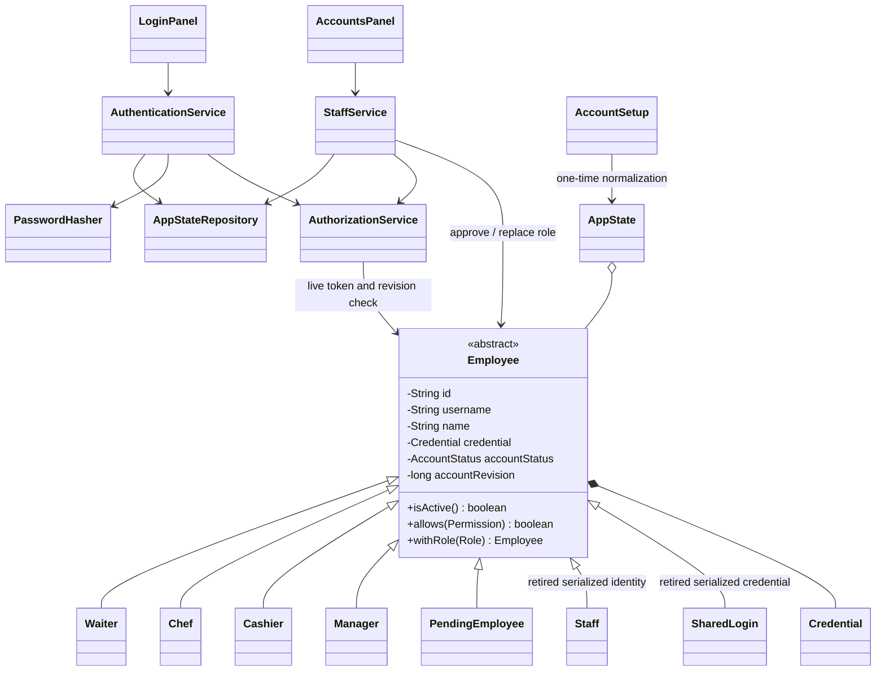
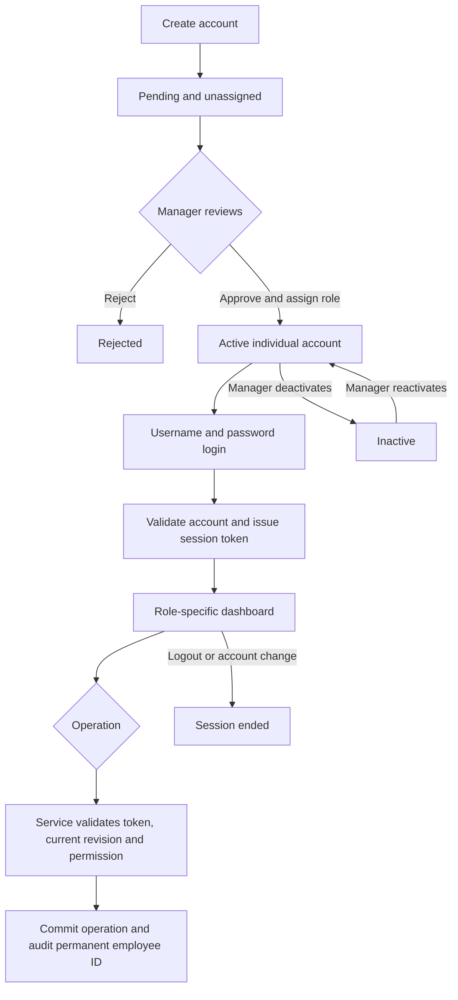

# Account design

The Role enum is an administration input; the Employee subtype remains the source of role
permissions. Role changes create a replacement subtype with the same employee ID, credentials,
name and lifecycle. Relationships from sessions/audits continue using that stable ID.

AccountStatus has Pending, Active, Rejected and Inactive values. New accounts remain Pending until
a Manager assigns a role and approves access. PresetAccounts installs four starter accounts once;
ApplicationServices applies old-file compatibility changes without extra login screens.
